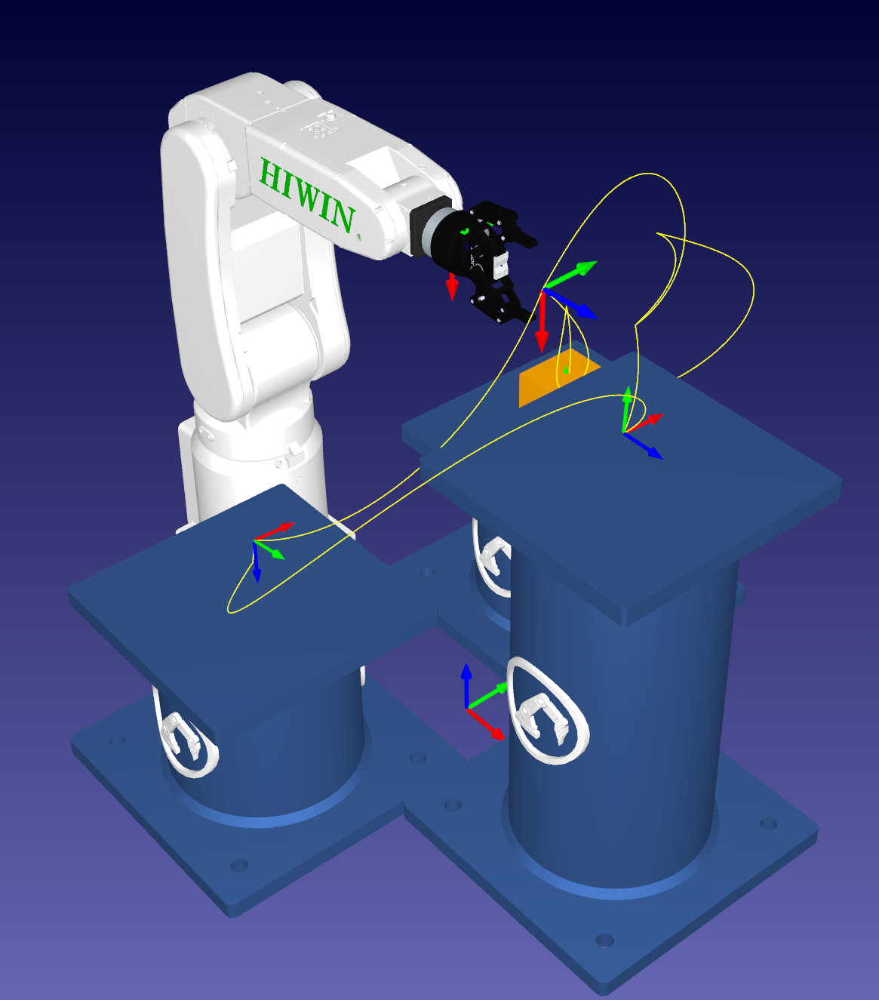

# Totus Tuus Keely — Engineering Portfolio

Personal engineering portfolio for Totus Tuus Keely, a Mechatronics Engineering student at Northern Illinois University.

**Live site:** https://totuskeely.github.io/

## About

This portfolio highlights selected engineering work in mechanical design, robotics, embedded systems, automation, manufacturing and testing.

The site is a lightweight static website built with HTML, CSS and JavaScript and hosted with GitHub Pages.

## Featured Projects

### Industrial Crossdraft Spray Booth
Mechanical design of a large industrial crossdraft spray booth using SolidWorks large assemblies, sheet metal, weldments, drawings, BOMs, PDM and design-for-manufacturing practices.

### Autonomous Quadruped Navigation Robot
Development of autonomous navigation logic for a 12-DOF quadruped robot using a Raspberry Pi 5, ESP32, servo-mounted ultrasonic sensing, Python, obstacle avoidance and wall-following logic.

### 6-DOF Industrial Robot Pick-and-Place
RoboDK simulation of a HIWIN RA605-710-GB industrial robot and RobotiQ 2F-85 gripper using coordinate frames, 4×4 homogeneous transformations, kinematics, motion planning and collision checking.

### Laser Welding Validation
Manufacturing and testing project involving laser welding, destructive testing, process comparison, engineering documentation and operator training.

## Updating Project Media

Project media is organized by project under `assets/images/`. Images and MP4 videos can be mixed in the same slideshow.

To update a slideshow:

1. Upload the new image or video into the appropriate project folder.
2. Edit only that project's `.gallery-slides` section in `index.html`.
3. Add, remove or reorder `<figure class="gallery-slide">` blocks.
4. Commit the changes to the `main` branch.

The JavaScript automatically generates thumbnails, captures a preview frame for videos, updates the slide count and pauses a video when the visitor changes slides.

Use `data-thumb-label` on a slide when you want a short thumbnail label while keeping a longer technical caption.

Example image slide:

```html
<figure class="gallery-slide" data-thumb-label="Tool path">
  
  <figcaption>End-effector path and target poses used to evaluate robot motion</figcaption>
</figure>
```

Example video slide:

```html
<figure class="gallery-slide" data-thumb-label="Simulation video">
  <video controls>
    <source src="assets/images/PickandPlace/PickPlaceVideo.mp4" type="video/mp4">
  </video>
  <figcaption>Complete simulated pick-and-place cycle across the three pedestal locations</figcaption>
</figure>
```

No separate thumbnail image or `poster` file is required for a video.

## Reports and Résumé

Technical briefs, reports and presentation files are stored in:

```text
assets/reports/
```

To update the résumé, replace:

```text
assets/Totus-Tuus-Keely-Resume.pdf
```

with the current version using the same filename.

## Repository Structure

```text
totuskeely.github.io/
│
├── index.html
├── styles.css
├── script.js
├── README.md
│
└── assets/
    ├── images/
    ├── reports/
    └── Totus-Tuus-Keely-Resume.pdf
```

## Favicon and Site Icons

The favicon package is stored in the repository root and includes browser, Apple touch and Android/PWA icon sizes. `index.html` references the favicon files and `site.webmanifest`.

## Confidentiality

Only materials approved for public use are included in this portfolio. Proprietary drawings, customer information, confidential dimensions, internal pricing, employer-owned source files and other restricted information are intentionally excluded.

## Contact

**Totus Tuus Keely**

- LinkedIn: https://www.linkedin.com/in/totus-keely/
- GitHub: https://github.com/TotusKeely
- Portfolio: https://totuskeely.github.io/

---

© 2026 Totus Tuus Keely
